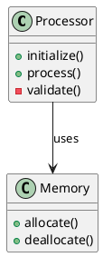

# мне нужно создать в vccode для проекта на c++ создать отчет  с полной детализацией каталогов, файлов,  описание + связи между ними, формат вывода карты можно  все (структура каталогов и классов, связи, диаграммы зависимостей или граф вызовов)

подскажи какие наилучшие для этого есть расширения

Отлично! Теперь у меня полная картина. Дам вам подробный отчет с лучшими решениями.

## Лучшие расширения и инструменты для анализа структуры C++ проекта

Я собрал для вас полный список инструментов, отсортированных по назначению. Выбирайте в зависимости от того, какой формат отчета вам нужен.

***

### 🎯 **Топ-3 рекомендуемые комбинации для вас**

#### **Вариант 1: Полная документация + графы (ЛУЧШИЙ)**

- **Doxygen** (основной инструмент)
- **Graphviz** (для генерации графов)
- **Расширение VS Code**: `doxygen` или `doxygen-documentation-generator`

**Результат**: HTML-документация с call graph, caller graph, диаграммы классов и зависимостей.

#### **Вариант 2: UML-диаграммы (для презентаций)**

- **PlantUML** + **VS Code Extension: PlantUML**
- Можно интегрировать с Doxygen

**Результат**: Красивые диаграммы (компоненты, классы, зависимости) в различных форматах.

#### **Вариант 3: Интеллектуальный анализ кода**

- **clangd** + **VS Code Extension: clangd**
- Для быстрого анализа структуры и навигации

**Результат**: Быстрый поиск, "Go to Definition", найти все использования, анализ структуры.

***

### 📦 **Детальное описание каждого инструмента**

#### **1. DOXYGEN** ⭐⭐⭐⭐⭐

**Назначение**: Полная документация с диаграммами

**Что генерирует:**

- 📄 Описание структуры каталогов
- 📊 Диаграммы классов
- 🔗 Call graph (граф вызовов функций)
- 🔄 Caller graph (обратный граф)
- 📋 Список всех файлов, функций, переменных
- 📈 Диаграммы наследования

**Установка (Linux/Mac):**

```bash
# macOS
brew install doxygen graphviz

# Ubuntu/Debian
sudo apt-get install doxygen graphviz
```

**Установка (Windows):**

- Скачайте с http://www.doxygen.nl/download.html
- Установите GraphViz отдельно: http://graphviz.org/download/

**Быстрый старт:**

```bash
cd ~/your_project
doxygen -g Doxyfile          # Создать конфиг
```

**Конфиг для максимальной детализации** (отредактировать `Doxyfile`):

```bash
PROJECT_NAME           = "MyProject"
OUTPUT_DIRECTORY       = ./doxydoc/
INPUT                  = ./src ./include
RECURSIVE              = YES
EXTRACT_ALL            = YES
EXTRACT_PRIVATE        = YES
EXTRACT_STATIC         = YES
HAVE_DOT               = YES
CALL_GRAPH             = YES
CALLER_GRAPH           = YES
UML_LOOK               = YES
GENERATE_HTML          = YES
GENERATE_LATEX         = YES
GENERATE_MAN           = YES
CLASS_DIAGRAMS         = YES
```

**Запуск:**

```bash
doxygen Doxyfile
```

**Результат**: Откройте `doxydoc/html/index.html` в браузере.

***

#### **2. VS CODE EXTENSIONS для Doxygen**

| Расширение | Функция | Рейтинг |
| :-- | :-- | :-- |
| **Doxygen Documentation Generator** | Auto-generate documentation comments | ⭐⭐⭐⭐⭐ |
| **Better Comments** | Подсветка комментариев Doxygen | ⭐⭐⭐⭐ |
| **Document This** | Генерация JSDoc-style комментариев | ⭐⭐⭐⭐ |
| **C++ Helper** | Быстрое добавление Doxygen комментов | ⭐⭐⭐⭐ |

**Установка в VS Code:**

```
Ctrl+Shift+X → поиск "Doxygen Documentation Generator" → Install
```


***

#### **3. PLANTUML** ⭐⭐⭐⭐

**Назначение**: UML-диаграммы архитектуры

**Что генерирует:**

- 🏗️ Диаграммы компонентов
- 🔀 Диаграммы классов и наследования
- 📊 Диаграммы развертывания
- 🔗 Диаграммы взаимодействия
- 📈 Диаграммы состояний

**Расширение VS Code**: `PlantUML`

```
Ctrl+Shift+X → поиск "PlantUML" → Install (от jebbs)
```

**Требования:**

```bash
# Ubuntu/Debian
sudo apt-get install default-jre graphviz

# macOS
brew install graphviz openjdk
```

**Пример диаграммы классов:**



**Горячие клавиши в VS Code:**

- `Alt + D` (Windows) или `Option + D` (Mac) - предпросмотр
- `Alt + E` - экспорт в PNG/SVG

***

#### **4. CLANGD** ⭐⭐⭐⭐

**Назначение**: Интеллектуальный анализ кода в реальном времени

**Что дает:**

- 🔍 "Go to Definition"
- 📍 "Find All References"
- 🔗 Иерархия вызовов функций
- ✅ Проверка типов и ошибок
- 💡 Умные подсказки

**Расширение VS Code**: `clangd`

```
Ctrl+Shift+X → поиск "clangd" → Install
```

**Конфиг (`settings.json`):**

```json
{
  "C_Cpp.intelliSenseEngine": "disabled",
  "clangd.arguments": [
    "--compile-commands-dir=build",
    "--header-insertion=iwyu",
    "--clang-tidy"
  ]
}
```


***

#### **5. GRAPHVIZ** (для визуализации)

**Назначение**: Генерация диаграмм из текстовых описаний

**Установка:**

```bash
# Ubuntu/Debian
sudo apt-get install graphviz

# macOS  
brew install graphviz

# Windows
# Скачать с http://graphviz.org/download/
```

**Пример использования:**

```bash
dot -Tpng -o output.png input.dot
```


***

### 📋 **Пошаговая инструкция для полного отчета**

#### **Шаг 1: Установка Doxygen + Graphviz**

```bash
# Ubuntu
sudo apt-get install doxygen graphviz

# macOS
brew install doxygen graphviz

# Проверка
doxygen --version
```


#### **Шаг 2: Создание конфига Doxygen**

```bash
cd /path/to/your/project
doxygen -g Doxyfile
```


#### **Шаг 3: Редактирование Doxyfile**

Откройте `Doxyfile` и измените:

```
PROJECT_NAME           = "Your Project"
PROJECT_BRIEF          = "Short description"
OUTPUT_DIRECTORY       = ./doxydoc
INPUT                  = ./src ./include
RECURSIVE              = YES
EXTRACT_ALL            = YES
EXTRACT_PRIVATE        = YES
EXTRACT_STATIC         = YES
EXTRACT_LOCAL_CLASSES  = YES
HAVE_DOT               = YES
CALL_GRAPH             = YES
CALLER_GRAPH           = YES
GENERATE_HTML          = YES
GENERATE_LATEX         = NO
UML_LOOK               = YES
CLASS_DIAGRAMS         = YES
DOT_GRAPH_MAX_NODES    = 1000
```


#### **Шаг 4: Генерация документации**

```bash
doxygen Doxyfile
```


#### **Шаг 5: Просмотр результатов**

```bash
# Linux/Mac
open doxydoc/html/index.html

# Windows
start doxydoc/html/index.html
```


***

### 🛠️ **Дополнительные инструменты**

| Инструмент | Назначение | Формат |
| :-- | :-- | :-- |
| **clang-include-graph** | Визуализация включений | DOT, PNG |
| **cppcheck** | Анализ кода + отчеты | HTML |
| **include-what-you-use** | Оптимизация включений | Текст |
| **Scope Diagram** | Диаграммы области видимости | Visual |


***

### 💡 **Рекомендация специально для вас**

Учитывая вашу работу с GPU и сложными CUDA-проектами, я бы рекомендовал:

1. **Основной инструмент**: **Doxygen** + **Graphviz**
    - Генерирует полный отчет со структурой, графами вызовов, диаграммами
    - Быстро работает даже на больших проектах
    - Можно интегрировать в CI/CD
2. **Для архитектурных диаграмм**: **PlantUML**
    - Для демонстрации на встречах/презентациях
    - Версионируется в Git
    - Красиво выглядит
3. **Для быстрого анализа в IDE**: **clangd**
    - Навигация по коду в реальном времени
    - Удобно при изучении новых файлов

**Комбинация**: На 95% случаев Doxygen + VS Code расширение "Doxygen Documentation Generator" будет достаточно для ваших нужд.

Нужны примеры конфигов под конкретный тип анализа или помощь с интеграцией в ваш проект?
<span style="display:none">[^1][^10][^11][^12][^13][^14][^15][^16][^17][^18][^19][^2][^20][^3][^4][^5][^6][^7][^8][^9]</span>

<div align="center">⁂</div>

[^1]: https://www.reddit.com/r/cpp_questions/comments/1jt4pkx/c_folder_structure_in_vs_code/

[^2]: https://stackoverflow.com/questions/9632347/c-code-dependency-call-graph-viewer

[^3]: https://dev.to/baduit/create-a-vscode-extension-for-my-esoteric-programming-language-1bch

[^4]: https://code.visualstudio.com/docs/cpp/config-linux

[^5]: https://la.mathworks.com/help/matlab/ref/dependencyanalyzer-app.html

[^6]: https://snyk.io/blog/modern-vs-code-extension-development-basics/

[^7]: https://code.visualstudio.com/docs/cpp/config-msvc

[^8]: https://www.reddit.com/r/cpp/comments/17cudl0/best_include_graph_dependency_tool_in_2023/

[^9]: https://stackoverflow.com/questions/67137031/vscode-extension-to-auto-generate-c-docstring

[^10]: https://code.visualstudio.com/docs/cpp/customize-cpp-settings

[^11]: http://web.evolbio.mpg.de/~boettcher/other/2016/creating_source_graph.html

[^12]: https://www.youtube.com/watch?v=xkwJ9GwgZJU

[^13]: https://forums.developer.nvidia.com/t/vscode-clangd-intellisense/304517

[^14]: https://darkognu.eu/programming/tutorials/doxygen_tutorial_cpp/

[^15]: https://hittheroad.dev/using-plantuml-inside-vscode-and-wsl2-2a4e3b2b0898

[^16]: https://botondballo.wordpress.com/2019/12/02/developing-mozilla-c-code-with-clangd-and-vscode/

[^17]: https://stackoverflow.com/questions/52318468/why-doesnt-doxygen-create-a-callgraph-of-my-c-code

[^18]: https://stackoverflow.com/questions/70039939/how-to-use-the-plantuml-preview-in-vscode

[^19]: https://julesfouchy.github.io/Learn--Clean-Code-With-Cpp/lessons/clangd/

[^20]: https://www.youtube.com/watch?v=pnnKzkNTo4w

